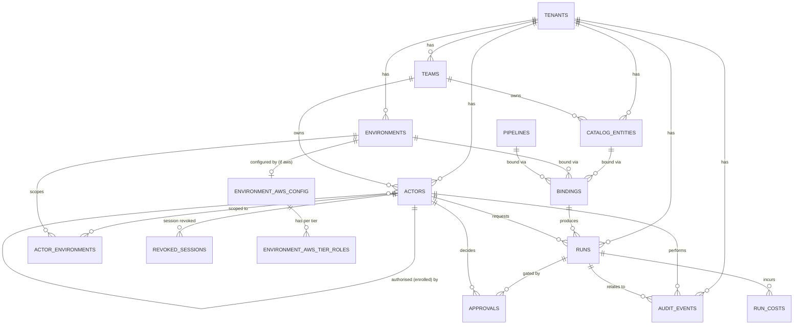

# Data Model

> **Status: draft, pre-implementation.** [ARCHITECTURE.md](ARCHITECTURE.md)'s Data model section names the core entities and the relations that matter; this document takes that one level further into tables, columns and constraints so Phase 0 has something to write a migration against. Treat it the same way as the rest of `docs/`: the design tool, not a record of something already built — no migrations exist yet. Where this doc fills a gap `ARCHITECTURE.md` left open, that is called out explicitly rather than presented as settled.

PostgreSQL, per [ARCHITECTURE.md](ARCHITECTURE.md)'s Technology table. Table names are `snake_case` and plural. Primary keys are `UUID DEFAULT gen_random_uuid()` throughout, so IDs never leak sequential information (run counts, tenant counts) to a client.

## Conventions

- **`tenant_id` on every tenant-scoped table**, first column, `NOT NULL`, `REFERENCES tenants(id)` — from the first migration, per [Decision 001](DECISIONS.md) and the DB rule in [CLAUDE.md](../CLAUDE.md). No table gets added on the assumption "single-tenant for now."
- **`created_at timestamptz NOT NULL DEFAULT now()`** on every table. `updated_at` only on tables that are actually mutated post-insert (not on `audit_events`, which is append-only by design).
- **Trust tier** stored as `smallint` with `CHECK (tier BETWEEN 1 AND 3)`, matching `pkg/identity.Tier` (`1=ReadOnly, 2=HumanInTheLoop, 3=Autonomous`) directly rather than a Postgres enum — the ordering *is* the meaning ([Decision 016](DECISIONS.md)), and a `smallint` keeps that ordering usable in a `CHECK` or a `>=` comparison without a cast.
- **Foreign keys default to `ON DELETE RESTRICT`.** Nothing in this model is safe to cascade-delete silently — an orphaned audit row is a compliance problem, not a cleanup convenience. Where cascade genuinely makes sense (e.g. a join table row when its parent is removed) it's called out per-table.
- **No `map[string]any`/raw `jsonb` past the boundary that parsed it**, per [CLAUDE.md](../CLAUDE.md) — the few `jsonb` columns below hold genuinely provider-shaped or free-form data (CI adapter settings, audit metadata), not a substitute for columns we were too lazy to define.

## Entity-relationship overview



## Tables

### `tenants`

| Column | Type | Notes |
|---|---|---|
| `id` | `uuid` PK | |
| `name` | `text` NOT NULL | |
| `created_at` | `timestamptz` NOT NULL DEFAULT `now()` | |

The root of every other table. Present from commit one even though v1 ships self-hosted single-tenant — see [Decision 001](DECISIONS.md).

### `teams`

| Column | Type | Notes |
|---|---|---|
| `id` | `uuid` PK | |
| `tenant_id` | `uuid` NOT NULL REFERENCES `tenants` | |
| `name` | `text` NOT NULL | |
| `created_at` | `timestamptz` NOT NULL DEFAULT `now()` | |

`UNIQUE (tenant_id, name)`. Catalog entries need owners and approvals need somewhere to route — actors and tenants alone are insufficient (per [ARCHITECTURE.md](ARCHITECTURE.md)).

### `actors`

| Column | Type | Notes |
|---|---|---|
| `id` | `uuid` PK | |
| `tenant_id` | `uuid` NOT NULL REFERENCES `tenants` | |
| `type` | `text` NOT NULL CHECK IN (`human`, `agent`) | mirrors `identity.ActorType` |
| `name` | `text` NOT NULL | display name (`claude-code-rhys`) |
| `team_id` | `uuid` NOT NULL REFERENCES `teams` | |
| `trust_tier` | `smallint` NOT NULL CHECK (1–3) | mirrors `identity.Tier` |
| `authorized_by` | `uuid` NULL REFERENCES `actors` | self-referential; who enrolled this actor — see [Decision 005](DECISIONS.md) and [AGENT-MODEL.md](AGENT-MODEL.md). `NULL` only for the actor bootstrapped by the static admin token |
| `status` | `text` NOT NULL DEFAULT `active` CHECK IN (`active`, `revoked`) | whole-identity revocation — see Session and revocation below |
| `expires_at` | `timestamptz` NULL | required in practice for agents ("indefinite agent credentials are not offered" — [AGENT-MODEL.md](AGENT-MODEL.md)); nullable because a human actor's *account* doesn't expire the same way a registered agent does |
| `created_at` | `timestamptz` NOT NULL DEFAULT `now()` | |
| `revoked_at` | `timestamptz` NULL | |

`identity.Claims.Delegation.AuthorizedBy`/`TeamID` are read off the verified token at request time and are **not** re-derived from this table per request (that would reintroduce a request-time trust decision the token is supposed to settle) — but this table is where `Issue` looks up the issuing actor's own tier to enforce [`ErrPrivilegeEscalation`](../pkg/identity/errors.go), and where enrolment and revocation are recorded.

### `actor_environments`

| Column | Type | Notes |
|---|---|---|
| `actor_id` | `uuid` NOT NULL REFERENCES `actors` ON DELETE CASCADE | |
| `environment_id` | `uuid` NOT NULL REFERENCES `environments` | |

`PRIMARY KEY (actor_id, environment_id)`. The granted environment scope captured at enrolment (`idpctl agent create --environments staging`). `identity.Claims.Environments` on an issued token must be a subset of an actor's rows here — enforced by `Issue`, not by a DB constraint, since `Issue` already holds the issuing actor's tier check and this is the same call.

### `environments`

| Column | Type | Notes |
|---|---|---|
| `id` | `uuid` PK | |
| `tenant_id` | `uuid` NOT NULL REFERENCES `tenants` | |
| `name` | `text` NOT NULL | e.g. `staging`, `prod-us-east-1` |
| `provider` | `text` NOT NULL DEFAULT `aws` CHECK IN (`aws`, `gcp`, `azure`) | mirrors `pkg/cloud.Provider` — only `aws` has an implementation in v1 ([Decision 017](DECISIONS.md)) |
| `region` | `text` NOT NULL | |
| `created_at` | `timestamptz` NOT NULL DEFAULT `now()` | |

`UNIQUE (tenant_id, name)`. Deliberately **provider-agnostic** — no AWS-shaped column lives here. `pkg/cloud.Broker` is a generic interface with only an AWS implementation in v1 ([Decision 017](DECISIONS.md)), and Decision 017's own consequence is explicit that "`pkg/cloud` must stay free of AWS-specific assumptions in its interface shape." The schema follows the same split: provider-specific identity and credential-binding fields live in per-provider tables (below), not as columns here that would sit `NULL` for every non-AWS row.

### Per-provider config: purpose and shape

Every governed action needs the worker's broker to answer one question: *given this `Environment` and this actor's tier, exactly which cloud-native identity do I assume, and how do I prove I'm allowed to?* Each provider answers that with two distinct pieces — an account-level identity, and a per-tier binding — but the *shape* of both is genuinely different per provider (AWS's `AssumeRole` + external ID has no GCP or Azure equivalent), so each provider gets its own pair of tables rather than shared nullable columns. This mirrors `pkg/cloud.Broker` (generic) vs `broker/aws` (concrete) — additive per provider, zero change to existing tables or rows when a new one is added. Only the AWS tables exist for v1; GCP/Azure are sketched here to show the pattern holds, not implemented now.

#### `environment_aws_config`

| Column | Type | Notes |
|---|---|---|
| `environment_id` | `uuid` PK, REFERENCES `environments` ON DELETE CASCADE | 1:1 — exists only for rows where `environments.provider = 'aws'` |
| `account_ref` | `text` NOT NULL | AWS account ID |
| `external_id` | `bytea` NOT NULL | STS external ID, **encrypted at rest** — see below |
| `trust_anchor` | `text` NOT NULL | the principal/OIDC-provider ARN the worker assumes from |

The account-level identity: which AWS account, what proves this isn't a confused-deputy attack, and which principal is trusted to assume into it. This is what `pkg/cloud.Broker.ValidateEnvironment` checks and hands to `MintCredentials` — without it the worker has no way to know which customer AWS account an `Environment` row refers to. **Never static keys** — this table stores identifiers used to *assume* a role, never a long-lived credential, matching the control plane's "never holds cloud credentials" invariant.

`external_id` sits in a middle tier of sensitivity: not a `pkg/ci.Secret`-grade live credential, but more sensitive than a plain ARN — AWS's own confused-deputy guidance treats a leaked external ID as weakening (though not by itself breaking) that protection. So it's stored **encrypted at rest** (`pgcrypto`, or application-level envelope encryption against a KMS-held key — pick one during Phase 0 implementation) and is **never returned in an API response body** once past initial registration, the same posture as a webhook signing key even though it doesn't get the full `pkg/ci.Secret` treatment (that pattern is for values the *worker* handles at runtime; this one only the control plane ever reads).

#### `environment_aws_tier_roles`

| Column | Type | Notes |
|---|---|---|
| `environment_id` | `uuid` NOT NULL REFERENCES `environment_aws_config` ON DELETE CASCADE | |
| `tier` | `smallint` NOT NULL CHECK (1–3) | |
| `role_arn` | `text` NOT NULL | |

`PRIMARY KEY (environment_id, tier)`. The per-tier binding: for this environment, which IAM role does a `ReadOnly` vs `HumanInTheLoop` vs `Autonomous` action assume — one role per tier, never one role narrowed by session policies ([Decision 006](DECISIONS.md)). `MintCredentials(cfg, tier)` looks this up before calling `sts:AssumeRole`. `role_arn` is a plain column: an ARN identifies a role but does not itself grant access to assume it (the role's trust policy and the external ID do that work), so it doesn't need the same encryption treatment as `external_id`.

#### GCP / Azure (sketch only, not implemented)

When those providers ship, each adds its own pair, following the same split — new tables, no migration of existing AWS rows, no change to AWS's own tables or code:

- `environment_gcp_config` (`project_id`, `workload_identity_pool`, `workload_identity_provider`, `service_account_email`) + `environment_gcp_tier_bindings` (`environment_id`, `tier`, `service_account_email`) — GCP's account-level identity is a Workload Identity Federation pool binding, not an assumable role.
- `environment_azure_config` (`tenant_id`, `client_id`) + `environment_azure_tier_bindings` (`environment_id`, `tier`, `federated_credential_subject`) — Azure's is a federated credential tied to an app registration and subject claim.

### `catalog_entities` *(Phase 2)*

| Column | Type | Notes |
|---|---|---|
| `id` | `uuid` PK | |
| `tenant_id` | `uuid` NOT NULL REFERENCES `tenants` | |
| `team_id` | `uuid` NOT NULL REFERENCES `teams` | owner |
| `name` | `text` NOT NULL | |
| `source_ref` | `text` NULL | where it was ingested from (repo + path to `catalog-info.yaml`, once [the ingestion mechanism](V1-ROADMAP.md) is decided) |
| `created_at` | `timestamptz` NOT NULL DEFAULT `now()` | |

`UNIQUE (tenant_id, name)`. What exists, who owns it — populated once the Phase 2 catalog ingestion mechanism lands; the table shape doesn't depend on which mechanism is chosen.

### `pipelines`

> **Not named in `ARCHITECTURE.md`'s Data model list.** That doc names `Binding` as the `entity ↔ environment ↔ pipeline` three-way relation but doesn't give "pipeline" its own row — this table is this doc's proposal for where a `pkg/ci.Config` (provider + settings) actually lives, and should be confirmed rather than treated as settled design.

| Column | Type | Notes |
|---|---|---|
| `id` | `uuid` PK | |
| `tenant_id` | `uuid` NOT NULL REFERENCES `tenants` | |
| `environment_id` | `uuid` NOT NULL REFERENCES `environments` | which environment this pipeline config applies to |
| `provider` | `text` NOT NULL | mirrors `pkg/ci.Provider` (`github_actions`, `gitlab_ci`, `jenkins`, `atlantis`, `bitbucket_pipelines`) |
| `workflow_ref` | `text` NOT NULL | e.g. a GitHub Actions workflow file path |
| `settings` | `jsonb` NOT NULL DEFAULT `'{}'` | mirrors `pkg/ci.Config.Settings` — provider-specific, deliberately loose since each adapter defines its own required keys via `Config.Require` |
| `created_at` | `timestamptz` NOT NULL DEFAULT `now()` | |

`pkg/ci.Config.Credential` is explicitly **never persisted** by the control plane (resolved by the worker immediately before use — see `pkg/ci/types.go`), so no credential column exists here by design.

### `bindings`

| Column | Type | Notes |
|---|---|---|
| `id` | `uuid` PK | |
| `tenant_id` | `uuid` NOT NULL REFERENCES `tenants` | |
| `catalog_entity_id` | `uuid` NOT NULL REFERENCES `catalog_entities` | |
| `environment_id` | `uuid` NOT NULL REFERENCES `environments` | |
| `pipeline_id` | `uuid` NOT NULL REFERENCES `pipelines` | |
| `created_at` | `timestamptz` NOT NULL DEFAULT `now()` | |

`UNIQUE (catalog_entity_id, environment_id, pipeline_id)`. This is how the catalog becomes an action surface — see [ARCHITECTURE.md](ARCHITECTURE.md) "Why the catalog connects to CI." A Phase 2 concept, since it depends on `catalog_entities`.

### `runs`

| Column | Type | Notes |
|---|---|---|
| `id` | `uuid` PK | this **is** the correlation ID injected into the external run (`pkg/ci.Handle.Correlation`) |
| `tenant_id` | `uuid` NOT NULL REFERENCES `tenants` | |
| `actor_id` | `uuid` NOT NULL REFERENCES `actors` | who requested it |
| `environment_id` | `uuid` NOT NULL REFERENCES `environments` | the environment this run executes against — required even before `bindings` exists (Phase 1 has runs but not yet a catalog) |
| `binding_id` | `uuid` NULL REFERENCES `bindings` | populated once Phase 2's catalog exists; `NULL` for a Phase 1 run triggered against a pipeline directly |
| `pipeline_id` | `uuid` NOT NULL REFERENCES `pipelines` | |
| `tier` | `smallint` NOT NULL CHECK (1–3) | the actor's tier **at request time**, snapshotted — a later change to the actor's tier must not retroactively change what an in-flight or historical run was authorised at |
| `status` | `text` NOT NULL | control-plane run state — see below, distinct from `pkg/ci.Status` |
| `ci_provider` | `text` NOT NULL | mirrors `pipelines.provider`, denormalised so a run's provider is knowable without a join even if the pipeline config later changes |
| `ci_external_ref` | `text` NULL | `pkg/ci.Handle.ExternalID` once resolved |
| `ci_raw_status` | `text` NULL | `pkg/ci.RunStatus.Raw` — provider-native status, kept because normalisation is lossy |
| `ci_url` | `text` NULL | |
| `idempotency_key` | `text` NULL | caller-supplied; see the API design rule in [CLAUDE.md](../CLAUDE.md) |
| `diff_ref` | `text` NULL | pointer to where the change diff is stored, for the approver — "the approver must see the change diff" ([ARCHITECTURE.md](ARCHITECTURE.md)) |
| `requested_at` | `timestamptz` NOT NULL DEFAULT `now()` | |
| `started_at` | `timestamptz` NULL | |
| `finished_at` | `timestamptz` NULL | |
| `created_at` | `timestamptz` NOT NULL DEFAULT `now()` | |

`UNIQUE (tenant_id, actor_id, idempotency_key) WHERE idempotency_key IS NOT NULL`.

`status` values follow the state machine in [ARCHITECTURE.md](ARCHITECTURE.md) exactly:

```
requested → policy_checked → awaiting_approval → queued → executing → succeeded
                  │                                                  → failed
                  └── denied                                         → cancelled
                                                                      → timed_out
```

`CHECK (status IN ('requested','policy_checked','denied','awaiting_approval','queued','executing','succeeded','failed','cancelled','timed_out'))`.

Log content itself (incremental `pkg/ci.LogChunk` output) is explicitly **not** modeled as a table here — it's high-volume, append-only, and a poor fit for Postgres rows at any real run volume. Treat it as an open question (object storage vs. a dedicated log store) rather than force a premature answer.

### `approvals`

| Column | Type | Notes |
|---|---|---|
| `id` | `uuid` PK | |
| `run_id` | `uuid` NOT NULL REFERENCES `runs` | |
| `requested_at` | `timestamptz` NOT NULL DEFAULT `now()` | |
| `approver_actor_id` | `uuid` NULL REFERENCES `actors` | `NULL` until decided |
| `decision` | `text` NULL CHECK IN (`approved`, `denied`) | |
| `decided_at` | `timestamptz` NULL | |

One row per run that reaches `awaiting_approval` (a run that auto-executes at `Autonomous` tier has no row here at all, rather than a row with an implicit auto-approval — the absence of a row *is* the signal that no human check occurred).

### `audit_events`

| Column | Type | Notes |
|---|---|---|
| `id` | `uuid` PK | |
| `tenant_id` | `uuid` NOT NULL REFERENCES `tenants` | |
| `occurred_at` | `timestamptz` NOT NULL DEFAULT `now()` | |
| `actor_id` | `uuid` NOT NULL REFERENCES `actors` | |
| `action` | `text` NOT NULL | e.g. `run.requested`, `approval.decided`, `credential.mint`, `agent.enrolled`, `agent.revoked`, `session.revoked` |
| `run_id` | `uuid` NULL REFERENCES `runs` | populated when the event relates to a run |
| `tier` | `smallint` NULL CHECK (1–3) | populated for `credential.mint` — the tier the credential was scoped to |
| `environment_id` | `uuid` NULL REFERENCES `environments` | populated for `credential.mint` |
| `ttl_seconds` | `integer` NULL | populated for `credential.mint` |
| `metadata` | `jsonb` NOT NULL DEFAULT `'{}'` | anything action-specific that doesn't warrant its own column yet |

**Append-only at the schema level**: the application DB role gets `INSERT`/`SELECT` only — no `UPDATE`/`GRANT`, no `DELETE` — per the audit invariant in [CLAUDE.md](../CLAUDE.md). No `updated_at`, deliberately.

Every credential mint is an audited event, not a separate table — [ARCHITECTURE.md](ARCHITECTURE.md) lists `AuditEvent` as the sole record of it, and giving `tier`/`environment_id`/`ttl_seconds` their own columns (rather than burying them in `metadata`) is what makes "audit and attribution views" ([V1-ROADMAP.md](V1-ROADMAP.md) 3b) queryable instead of a wall of JSON.

### `run_costs` *(Phase 1)*

| Column | Type | Notes |
|---|---|---|
| `id` | `uuid` PK | |
| `run_id` | `uuid` NOT NULL REFERENCES `runs` | |
| `amount_micros` | `bigint` NOT NULL | cost in micro-units of `currency`, avoiding float rounding on money |
| `currency` | `text` NOT NULL DEFAULT `USD` | |
| `captured_at` | `timestamptz` NOT NULL DEFAULT `now()` | |

Per-run cost capture, rolling up per actor in the Phase 3b cost views — the rollup itself is a query over this table (`GROUP BY actor_id` via `runs`), not a separately maintained aggregate table.

## Session and revocation

[AGENT-MODEL.md](AGENT-MODEL.md)'s token lifecycle table states a session can be revoked "individually... taking effect immediately." As written today, `identity.Verify` ([token.go](../pkg/identity/token.go)) is pure Ed25519 signature verification with no DB lookup and no per-session identifier in the claims — so immediate revocation is not actually possible yet. This doc resolves that gap with a concrete design, which is new work beyond what's currently in `pkg/identity`:

1. **Add a `jti` (JWT ID) claim** to `jwtClaims` in `token.go`, generated by `Issuer.Issue` (e.g. `uuid.New().String()`) — the session's own identifier, distinct from the actor's `id`.
2. **`revoked_sessions` table**:

   | Column | Type | Notes |
   |---|---|---|
   | `jti` | `uuid` PK | |
   | `actor_id` | `uuid` NOT NULL REFERENCES `actors` | |
   | `revoked_at` | `timestamptz` NOT NULL DEFAULT `now()` | |
   | `expires_at` | `timestamptz` NOT NULL | copied from the token's own `exp` — a revocation row has no reason to outlive the token it revokes |

   A row here means "reject this session's token even though the signature and `exp` are still valid." Prune rows once `expires_at` has passed — the underlying token would be rejected on expiry alone by then.

3. **Two independent revocation checks at verify time**, both cheap single-row lookups (and both cacheable with a short TTL if verification latency matters — an eventually-consistent cache is an acceptable trade specifically because both checks only ever *narrow* a still-cryptographically-valid token, never widen one):
   - `actors.status = 'revoked'` — kills every session for that actor at once (whole-identity revocation).
   - `revoked_sessions` by `jti` — kills one session without touching the actor's other sessions, per [AGENT-MODEL.md](AGENT-MODEL.md)'s "kill one compromised session without disabling the agent everywhere."
4. **`Verify` takes a narrow `RevocationChecker` interface** (`IsRevoked(ctx, actorID, jti string) (bool, error)`), defined at the point of use in `pkg/identity` rather than importing a DB driver — consistent with the small-interfaces-at-point-of-use convention in [CLAUDE.md](../CLAUDE.md), and it keeps `pkg/identity` free of a Postgres dependency. The control plane wires a Postgres-backed implementation; anything else (a test) wires a fake.

This means `Verify`'s signature changes from pure-function signature verification to something that takes a revocation check and a context — a real code change to `pkg/identity`, not just a migration, and should land as part of the same Phase 0 work that adds enrolment/revocation.

## Mapping to existing Go types

| Table | Go type | Where |
|---|---|---|
| `actors` (+ `actor_environments`) | `identity.Claims`, `identity.IssueRequest` | `pkg/identity/types.go` |
| `revoked_sessions` | new `jti` claim + `RevocationChecker` | `pkg/identity/token.go` (change required — see above) |
| `pipelines` | `ci.Config`, `ci.Provider` | `pkg/ci/types.go` |
| `runs` (CI-facing columns) | `ci.Handle`, `ci.RunStatus`, `ci.Status` | `pkg/ci/types.go` |
| `environments` / `environment_aws_config` / `environment_aws_tier_roles` | `cloud.EnvironmentConfig` (per [ARCHITECTURE.md](ARCHITECTURE.md)'s `pkg/cloud.Broker`) | `worker/internal/broker/aws` (Phase 0) |

## Open questions / gaps this doc surfaces

- **`pipelines` is this doc's addition, not named in `ARCHITECTURE.md`.** Confirm the shape (per-environment config vs. something scoped differently) before treating it as settled.
- **Run log storage** is deliberately not modeled as a Postgres table above — needs a decision (object storage, a log-shipping sink, or a genuinely append-heavy table with aggressive retention) before Phase 1's log-capture requirement is implementable.
- **Telemetry events** (opt-in, [V1-ROADMAP.md](V1-ROADMAP.md) Phase 1) have no schema here — out of scope for this pass since the shape depends on what's actually opted into, but flagged so it doesn't get silently forgotten.
- **`catalog_entities.source_ref`** depends on the Phase 2 catalog ingestion mechanism, which [V1-ROADMAP.md](V1-ROADMAP.md) lists as an open decision — the column exists but its meaning is provisional.
